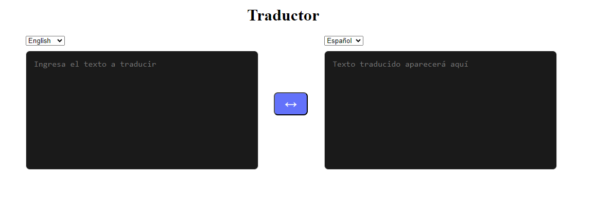

# Traductor de Idiomas

Este proyecto es un **traductor de idiomas** que utiliza la API de DeepL para ofrecer traducciones precisas y rápidas. La aplicación está construida con **React** y **JavaScript**, y emplea **Bootstrap** para un diseño responsivo y atractivo. Actualmente, soporta los siguientes idiomas:

- 🇬🇧 Inglés (EN)
- 🇪🇸 Español (ES)
- 🇫🇷 Francés (FR)
- 🇮🇹 Italiano (IT)
- 🇩🇪 Alemán (DE)

Con una interfaz de usuario intuitiva, los usuarios pueden introducir texto en un idioma, seleccionar el idioma de destino, y obtener la traducción al instante. Además, el proyecto incluye funcionalidades para intercambiar idiomas fácilmente.
